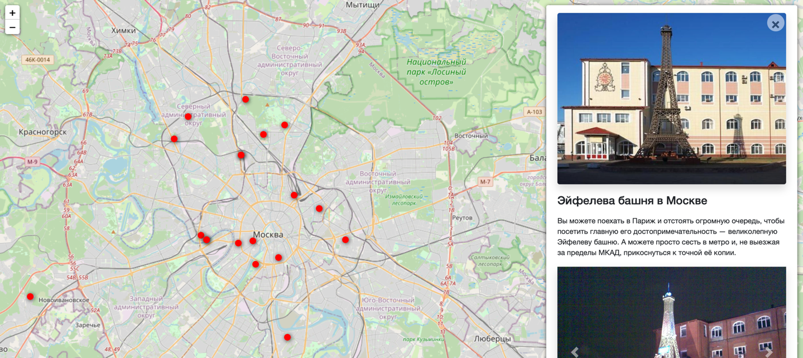

# Проект Яндекс Афиша

Проект аналога Яндекс Афиши. Сайт представляет собой интерактивную карту на которой обозначены геолокация событий вместе с их описанием


## Запуск

Для запуска сайта вам понадобится Python третьей версии.

Скачайте код с GitHub. Запустите виртуальное окружение и  установите зависимости:

```
pip install -r requirements.txt
```

Создайте базу данных SQLite

```
python3 manage.py migrate
```

Запустите сервер

```
python3 manage.py runserver
```

## Переменные окружения

Часть настроек проекта берётся из переменных окружения. Чтобы их определить, создайте файл `.env` рядом с `settings.py` в папке mysite и запишите туда данные в таком формате: `ПЕРЕМЕННАЯ=значение`.

Доступны 3 переменные:
- `DEBUG` — дебаг-режим. Поставьте `True`, чтобы увидеть отладочную информацию в случае ошибки.
- `SECRET_KEY` — секретный ключ проекта
- `ALLOWED_HOSTS` — см [документацию Django](https://docs.djangoproject.com/en/3.1/ref/settings/#allowed-hosts)


## Цели проекта

Код написан в учебных целях — для курса по Python и веб-разработке на сайте [Devman](https://dvmn.org).
